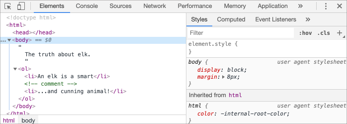
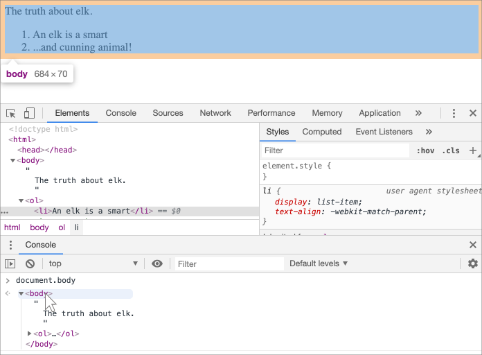

libs:
  - d3
  - domtree

---

# L'arbre DOM

L'épine dorsale d'un document HTML est constituée de balises.

Selon le modèle d'objets de document (DOM), chaque balise HTML est un objet.
Les balises imbriquées sont des "enfants" de celle qui les entoure.
Le texte à l'intérieur d'une balise est également un objet.

Tous ces objets sont accessibles via JavaScript, et nous pouvons les utiliser pour modifier la page.

Par exemple, `document.body` est l'objet représentant la balise `<body>`.

L'exécution de ce code rendra le `<body>` rouge pendant 3 secondes :

```js run
document.body.style.background = 'red'; // make the background red

setTimeout(() => document.body.style.background = '', 3000); // return back
```

Ici, nous avons utilisé `style.background` pour changer la couleur d'arrière-plan de `document.body`, mais il existe de nombreuses autres propriétés, telles que :

- `innerHTML` -- Contenu HTML du nœud.
- `offsetWidth` -- la largeur du nœud (en pixels)
- … etc.

Bientôt, nous apprendrons plus de façons de manipuler le DOM, mais nous devons d'abord connaître sa structure.

## Un exemple du DOM

Commençons par le simple document suivant :

```html run no-beautify
<!DOCTYPE HTML>
<html>
<head>
  <title>About elk</title>
</head>
<body>
  The truth about elk.
</body>
</html>
```

Le DOM représente le HTML comme une structure arborescente de balises.
Voici à quoi ça ressemble :

<div class="domtree"></div>

<script>
let node1 = {"name":"HTML","nodeType":1,"children":[{"name":"HEAD","nodeType":1,"children":[{"name":"#text","nodeType":3,"content":"\n  "},{"name":"TITLE","nodeType":1,"children":[{"name":"#text","nodeType":3,"content":"About elk"}]},{"name":"#text","nodeType":3,"content":"\n"}]},{"name":"#text","nodeType":3,"content":"\n"},{"name":"BODY","nodeType":1,"children":[{"name":"#text","nodeType":3,"content":"\n  The truth about elk.\n"}]}]}

drawHtmlTree(node1, 'div.domtree', 690, 320);
</script>

```online
Sur l'image ci-dessus, vous pouvez cliquer sur les nœuds des éléments et leurs enfants s'ouvriront/se réduiront.
```

Chaque nœud de l'arbre est un objet.

Les balises sont des *nœuds d'élément* (ou simplement des éléments) et forment la structure arborescente : `<html>` est à la racine, puis `<head>` et `<body>` sont ses enfants, etc.

Le texte à l'intérieur des éléments forme *des nœuds texte*, étiquetés comme `#text`.
Un nœud texte ne contient qu'une chaîne de caractères.
Il peut ne pas avoir d'enfants et est toujours une feuille de l'arbre.

Par exemple, la balise `<title>` a le texte `"About elk"`.

Veuillez noter les caractères spéciaux dans les nœuds texte :

- une nouvelle ligne : `↵` (en JavaScript appelé `\n`)
- un espace : `␣`

Les espaces et les nouvelles lignes sont des caractères totalement valides, comme les lettres et les chiffres.
Ils forment des nœuds de texte et deviennent une partie du DOM.
Ainsi, par exemple, dans l'exemple ci-dessus, la balise `<head>` contient des espaces avant `<title>`, et ce texte devient un nœud `#text` (il contient une nouvelle ligne et quelques espaces uniquement).

Il n'y a que deux exclusions de haut niveau :
1.
Les espaces et les nouvelles lignes avant `<head>` sont ignorés pour des raisons historiques.
2.
Si nous mettons quelque chose après `</body>`, alors cela est automatiquement déplacé à l'intérieur du `body`, à la fin, car la spécification HTML exige que tout le contenu soit à l'intérieur de `<body>`.
Il ne peut donc pas y avoir d'espace après `</body>`.

Dans d'autres cas, tout est simple -- s'il y a des espaces (comme n'importe quel caractère) dans le document, alors ils deviennent des nœuds texte dans le DOM, et si nous les supprimons, il n'y en aura pas.

Voici des nœud de texte sans espace :

```html no-beautify
<!DOCTYPE HTML>
<html><head><title>About elk</title></head><body>The truth about elk.</body></html>
```

<div class="domtree"></div>

<script>
let node2 = {"name":"HTML","nodeType":1,"children":[{"name":"HEAD","nodeType":1,"children":[{"name":"TITLE","nodeType":1,"children":[{"name":"#text","nodeType":3,"content":"About elk"}]}]},{"name":"BODY","nodeType":1,"children":[{"name":"#text","nodeType":3,"content":"The truth about elk."}]}]}

drawHtmlTree(node2, 'div.domtree', 690, 210);
</script>

```smart header="Les espaces au début/à la fin de la chaîne de caractères et les nœuds texte uniquement composé d'espaces sont généralement masqués dans les outils"
Les outils de navigation (qui seront bientôt traités) qui fonctionnent avec le DOM n'affichent généralement pas d'espaces au début/fin du texte et des nœuds texte vides (sauts de ligne) entre les balises.

Les outils de développement permettent d'économiser de l'espace d'écran de cette façon.

Sur d'autres images DOM, nous les omettons parfois lorsqu'elles ne sont pas pertinentes.
Ces espaces n'affectent généralement pas la façon dont le document est affiché.
```

## Auto-correction

Si le navigateur rencontre du HTML mal formé, il le corrige automatiquement lors de la création du DOM.

Par exemple, la balise la plus haute est toujours `<html>`.
Même s'elle n'existe pas dans le document, elle existera dans le DOM, car le navigateur la créera.
Il en va de même pour `<body>`.

Par exemple, si le fichier HTML est le seul mot `"Hello"`, le navigateur l'enroulera dans `<html>` et `<body>`, et ajoutera le `<head>` requis, et le DOM sera :

<div class="domtree"></div>

<script>
let node3 = {"name":"HTML","nodeType":1,"children":[{"name":"HEAD","nodeType":1,"children":[]},{"name":"BODY","nodeType":1,"children":[{"name":"#text","nodeType":3,"content":"Hello"}]}]}

drawHtmlTree(node3, 'div.domtree', 690, 150);
</script>

Lors de la génération du DOM, les navigateurs traitent automatiquement les erreurs dans le document, ferment les balises, etc.

Un document avec des balises non fermées :

```html no-beautify
<p>Hello
<li>Mom
<li>and
<li>Dad
```

… deviendra un DOM normal à mesure que le navigateur lit les balises et restaure les parties manquantes :

<div class="domtree"></div>

<script>
let node4 = {"name":"HTML","nodeType":1,"children":[{"name":"HEAD","nodeType":1,"children":[]},{"name":"BODY","nodeType":1,"children":[{"name":"P","nodeType":1,"children":[{"name":"#text","nodeType":3,"content":"Hello"}]},{"name":"LI","nodeType":1,"children":[{"name":"#text","nodeType":3,"content":"Mom"}]},{"name":"LI","nodeType":1,"children":[{"name":"#text","nodeType":3,"content":"and"}]},{"name":"LI","nodeType":1,"children":[{"name":"#text","nodeType":3,"content":"Dad"}]}]}]}

drawHtmlTree(node4, 'div.domtree', 690, 360);
</script>

````warn header="Les tableaux ont toujours `<tbody>`"
Un "cas spécial" intéressant est celui des tableaux.
Selon la spécification DOM, ils doivent avoir un `<tbody>`, mais le texte HTML peut (officiellement) l'omettre.
Ensuite, le navigateur crée automatiquement le `<tbody>` dans le DOM.

Pour le HTML :

```html no-beautify
<table id="table"><tr><td>1</td></tr></table>
```

La structure du DOM sera :
<div class="domtree"></div>

<script>
let node5 = {"name":"TABLE","nodeType":1,"children":[{"name":"TBODY","nodeType":1,"children":[{"name":"TR","nodeType":1,"children":[{"name":"TD","nodeType":1,"children":[{"name":"#text","nodeType":3,"content":"1"}]}]}]}]};

drawHtmlTree(node5,  'div.domtree', 600, 200);
</script>

Vous voyez ? Le `<body>` est sorti de nulle part.
Vous devez garder cela à l'esprit lorsque vous travaillez avec des tableaux pour éviter les surprises.
````

## Autres types de nœuds

Il existe d'autres types de nœuds en plus des éléments et des nœuds de texte.

Par exemple, les commentaires :

```html
<!DOCTYPE HTML>
<html>
<body>
  The truth about elk.
  <ol>
    <li>An elk is a smart</li>
*!*
    <!-- comment -->
*/!*
    <li>...and cunning animal!</li>
  </ol>
</body>
</html>
```

<div class="domtree"></div>

<script>
let node6 = {"name":"HTML","nodeType":1,"children":[{"name":"HEAD","nodeType":1,"children":[]},{"name":"BODY","nodeType":1,"children":[{"name":"#text","nodeType":3,"content":"\n  The truth about elk.\n  "},{"name":"OL","nodeType":1,"children":[{"name":"#text","nodeType":3,"content":"\n    "},{"name":"LI","nodeType":1,"children":[{"name":"#text","nodeType":3,"content":"An elk is a smart"}]},{"name":"#text","nodeType":3,"content":"\n    "},{"name":"#comment","nodeType":8,"content":"comment"},{"name":"#text","nodeType":3,"content":"\n    "},{"name":"LI","nodeType":1,"children":[{"name":"#text","nodeType":3,"content":"...and cunning animal!"}]},{"name":"#text","nodeType":3,"content":"\n  "}]},{"name":"#text","nodeType":3,"content":"\n\n\n"}]}]};

drawHtmlTree(node6, 'div.domtree', 690, 500);
</script>

Nous pouvons voir ici un nouveau type de nœud de l'arbre - *nœud commentaire*, étiqueté comme `#comment`, entre deux nœuds texte.

Nous pouvons penser - pourquoi un commentaire est-il ajouté au DOM ? Cela n'affecte en rien la représentation visuelle.
Mais il y a une règle -- si quelque chose est en HTML, alors il doit aussi être dans l'arborescence DOM.

**Tout en HTML, même les commentaires, devient une partie du DOM.**

Même la directive `<!DOCTYPE...>` au tout début du html est également un noeud du dom.
C'est dans l'arborescence du DOM juste avant `<html>`.
Peu de gens le savent.
Nous n'allons pas toucher ce nœud, nous ne le dessinons même pas sur les diagrammes pour cette raison, mais il est là.

L'objet `document` qui représente l'ensemble du document est également, formellement, un nœud dom.

Il existe [12 types de nœuds](https://dom.spec.whatwg.org/#node).
En pratique, nous travaillons généralement avec 4 d'entre eux :

1.
le `document` -- le "point d'entrée" dans le dom.
2.
les nœuds éléments -- les balises HTML, les blocs de construction de l'arborescence.
3.
les nœuds texte -- contient du texte.
4.
les commentaires -- parfois, nous pouvons y mettre des informations, elles ne seront pas affichées, mais js peut les lire depuis le dom.

## Voyez par vous-même

Pour voir la structure dom en temps réel, essayez le [live DOM viewer](https://software.hixie.ch/utilities/js/live-dom-viewer/).
Tapez simplement le document, et il apparaîtra comme un dom en un instant.

Une autre façon d'explorer le dom est d'utiliser les outils de développement du navigateur.
en fait, c'est ce que nous utilisons lors du développement.

Pour ce faire, ouvrez la page web [elk.html](elk.html), activez les outils de développement du navigateur et passez à l'onglet éléments.

Cela devrait ressembler à ça :



Vous pouvez voir le dom, cliquer sur les éléments, voir leurs détails et ainsi de suite.

Veuillez noter que la structure du dom dans les outils de développement est simplifiée.
les nœuds texte sont affichés comme du texte.
Et il n'y a aucun nœud texte "vide" (espace uniquement).
C'est très bien, car la plupart du temps nous nous intéressons aux nœuds éléments.

En cliquant sur le bouton <span class="devtools" style="background-position:-328px -124px"></span> dans le coin supérieur gauche cela nous permet de choisir un nœud à partir de la page Web à l'aide d'une souris (ou d'autres périphériques de pointeur) et de "l'inspecter" (faites défiler jusqu'à l'onglet Éléments).
cela fonctionne très bien lorsque nous avons une énorme page html (et un énorme dom correspondant) et que nous aimerions voir la place d'un élément particulier.

Une autre façon de le faire serait simplement de cliquer avec le bouton droit sur une page Web et de sélectionner "inspecter" dans le menu contextuel.


Dans la partie droite des outils se trouvent les sous-onglets suivants :
- **Styles** -- nous pouvons voir le CSS appliqué à l'élément en cours, règle par règle, y compris les règles intégrées (gris).
Presque tout peut être modifié sur place, y compris les dimensions/margins/paddings de la boîte ci-dessous.
- **Computed** -- pour voir le CSS appliqué à l'élément par propriété : pour chaque propriété, nous pouvons voir une règle qui la lui donne (y compris l'héritage CSS et autres).
- **Event Listeners** -- pour voir les écouteurs d'événements attachés aux éléments du DOM (nous les couvrirons dans la prochaine partie du tutoriel).
- … etc.

La meilleure façon de les étudier est de cliquer dessus.
La plupart des valeurs sont modifiables sur place.

## Interaction avec la console

Comme nous travaillons le DOM, nous pouvons également vouloir lui appliquer du JavaScript.
Comme : obtenir un nœud et exécuter du code pour le modifier, pour voir le résultat.
Voici quelques conseils pour voyager entre l'onglet Elements et la console.

Pour commencer :

1.
Sélectionnez le premier `<li>` dans l'onglet Éléments.
2.
Appuyez sur la touche `key:Esc` -- cela ouvrira la console juste en dessous de l'onglet Éléments.

Maintenant, le dernier élément sélectionné est disponible en tant que `$0`, le précédent sélectionné est `$1`, etc.

Nous pouvons exécuter des commandes sur eux.
Par exemple, `$0.style.background = 'red'` rend l'élément de la liste sélectionné rouge, comme ceci :


Voilà comment obtenir un nœud à partir d'Elements dans la console.

Il y a aussi un chemin de retour.
S'il y a une variable référençant un nœud DOM, alors nous pouvons utiliser la commande `inspect(node)` dans la console pour la voir dans le volet Éléments.

Ou nous pouvons simplement sortir le nœud DOM dans la console et explorer "sur place", comme `document.body` ci-dessous :



C'est à des fins de débogage bien sûr.
À partir du chapitre suivant, nous accéderons et modifierons le DOM en utilisant JavaScript.

Les outils de développement du navigateur sont d'une grande aide au développement : nous pouvons explorer le DOM, essayer des choses et voir ce qui ne va pas.

## Résumé

Un document HTML/XML est représenté dans le navigateur sous forme d'arbre DOM.

- Les balises deviennent des nœuds élément et forment la structure.
- Le texte devient des nœuds texte.
- … etc, tout en HTML a sa place dans le DOM, même les commentaires.

Nous pouvons utiliser les outils de développement pour inspecter le DOM et le modifier manuellement.

Ici, nous avons couvert les bases, les actions les plus utilisées et les plus importantes pour commencer.
Il existe une documentation complète sur Chrome Developer Tools à l'adresse <https://developers.google.com/web/tools/chrome-devtools>.
La meilleure façon d'apprendre les outils est de cliquer ici et là, lire les menus : la plupart des options sont évidentes.
Plus tard, lorsque vous les connaissez en général, lisez la documentation et découvrez le reste.

Les nœuds DOM ont des propriétés et des méthodes qui nous permettent de voyager entre eux, de les modifier, de se déplacer dans la page, etc.
Nous y reviendrons dans les prochains chapitres.
