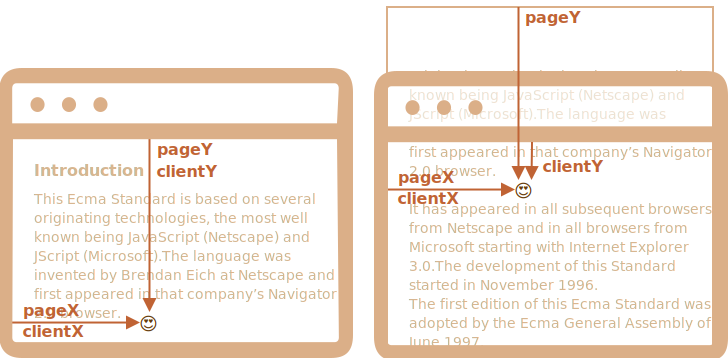
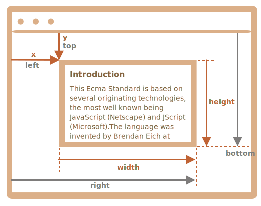

# Coordonnées

Pour déplacer des éléments, nous devons être familiers avec les coordonnées.

La plupart des méthodes JavaScript traitent de l'un des deux systèmes de coordonnées :

1. **Par rapport à la fenêtre** - similaire à `position:fixed`, calculé à partir du bord supérieur/gauche de la fenêtre.
    - nous désignerons ces coordonnées comme `clientX/clientY`, le raisonnement pour un tel nom deviendra clair plus tard, lorsque nous étudierons les propriétés de l'événement.
2. **Par rapport au document** - similaire à `position:absolue` à la racine du document, calculé à partir du bord supérieur/gauche du document.
    - nous les dénotons `pageX/pageY`.

Lorsque la page défile jusqu'au tout début, de sorte que le coin supérieur/gauche de la fenêtre soit exactement le coin supérieur/gauche du document, ces coordonnées sont égales. Mais après le déplacement du document, les coordonnées relatives à la fenêtre des éléments changent, à mesure que les éléments se déplacent à travers la fenêtre, tandis que les coordonnées relatives au document restent les mêmes.

Sur cette image, nous prenons un point dans le document et démontrons ses coordonnées avant le défilement (à gauche) et après (à droite) :



Lorsque le document défile :
- `pageY` - La coordonnée relative au document est restée la même, elle est comptée à partir du haut du document (maintenant défilée).
- `clientY` - la coordonnée relative à la fenêtre a changé (la flèche est devenue plus courte), car le même point s'est rapproché du haut de la fenêtre.

## Coordonnées des éléments : getBoundingClientRect

La méthode `elem.getBoundingClientRect()` renvoie les coordonnées de la fenêtre pour un rectangle minimal qui entoure `elem` en tant qu'objet de la classe intégrée [DOMRect](https://www.w3.org/TR/geometry-1/#domrect).

Propriétés principales de `DOMRect` :

- `x/y` -- Coordonnées X/Y de l'origine du rectangle par rapport à la fenêtre,
- `width/height` -- largeur/hauteur du rectangle (peut être négatif).

De plus, il existe des propriétés dérivées :

- `top/bottom` -- Coordonnée Y pour le bord supérieur/inférieur du rectangle,
- `left/right` -- Coordonnée X pour le bord du rectangle gauche/droit.

```online
Par exemple, cliquez sur ce bouton pour voir les coordonnées de sa fenêtre :

<p><input id="brTest" type="button" value="Get coordinates using button.getBoundingClientRect() for this button" onclick='showRect(this)'/></p>

<script>
function showRect(elem) {
  let r = elem.getBoundingClientRect();
  alert(`x:${r.x}
y:${r.y}
width:${r.width}
height:${r.height}
top:${r.top}
bottom:${r.bottom}
left:${r.left}
right:${r.right}
`);
}
</script>

Si vous faites défiler la page et répétez, vous remarquerez que lorsque la position du bouton relatif à la fenêtre change, ses coordonnées de fenêtre (`y/top/bottom` si vous faites défiler verticalement) changent également.
```

Voici l'image de la sortie de `elem.getBoundingClientRect()` :



Comme vous pouvez le voir, `x/y` et `width/height` décrivent entièrement le rectangle. Les propriétés dérivées peuvent être facilement calculées à partir d'eux :

- `left = x`
- `top = y`
- `right = x + width`
- `bottom = y + height`

Veuillez noter :

- Les coordonnées peuvent être des fractions décimales, telles que `10.5`. C'est normal, le navigateur utilise en interne des fractions dans les calculs. Nous n'avons pas à les arrondir lors de la définition de `style.left/top`.
- Les coordonnées peuvent être négatives. Par exemple, si la page défile de sorte que `elem` se trouve maintenant au-dessus de la fenêtre, alors `elem.getBoundingClientRect().top` est négatif.

```smart header="Pourquoi des propriétés dérivées sont nécessaires ? Pourquoi `top/left` existent-ils s'il y a `x/y` ?"
Mathématiquement, un rectangle est défini de façon unique avec son point de départ `(x,y)` et le vecteur de direction `(width,height)`. Les propriétés dérivées supplémentaires sont donc pour plus de commodité.

Techniquement, il est possible que `width/height` soit négatif, ce qui permet un rectangle "dirigé", par exemple pour représenter la sélection de la souris avec un début et une fin correctement marqués.

Les valeurs négatives de `width/height` signifient que le rectangle commence à son coin inférieur droit puis "grandit" de gauche à droite.

Voici un rectangle avec une `width` et `height` (par exemple `width=-200`, `height=-100`) :


Comme vous pouvez le voir, `left/top` n'est pas égal à `x/y` dans ce cas.

En pratique cependant, `elem.getBoundingClientRect()` retourne toujours une largeur/hauteur positive, ici nous mentionnons une largeur/hauteur négative uniquement pour que vous compreniez pourquoi ces propriétés apparemment en double ne sont pas en fait des doublons.
```

<<<<<<< HEAD
```warn header="Internet Explorer et Edge : pas de support pour `x/y`"
Internet Explorer et Edge ne prennent pas en charge les propriétés `x/y` pour des raisons historiques.
=======
```warn header="Internet Explorer: no support for `x/y`"
Internet Explorer doesn't support `x/y` properties for historical reasons.
>>>>>>> e074a5f825a3d10b0c1e5e82561162f75516d7e3

Nous pouvons donc soit faire un polyfill (ajouter des getters dans `DomRect.prototype`), soit simplement utiliser `top/left`, car ils sont toujours les mêmes que `x/y` pour un 
`width/height` positif, en particulier dans le résultat de `elem.getBoundingClientRect()`.
```

```warn header="Les coordonnées droite / inférieure sont différentes des propriétés de position CSS"
Il existe des similitudes évidentes entre les coordonnées relatives à la fenêtre et CSS `position:fixed`.

Mais dans le positionnement CSS, la propriété `right` signifie la distance par rapport au bord droit, et la propriété `bottom` signifie la distance par rapport au bord inférieur.

Si nous regardons simplement l'image ci-dessus, nous pouvons voir qu'en JavaScript, ce n'est pas le cas. Toutes les coordonnées de la fenêtre sont comptées à partir du coin supérieur gauche, y compris celles-ci.
```

## elementFromPoint(x, y) [#elementFromPoint]

L'appel à `document.elementFromPoint(x,y)` renvoie l'élément le plus imbriqué aux coordonnées de la fenêtre `(x,y)`.

La syntaxe est :

```js
let elem = document.elementFromPoint(x, y);
```

Par exemple, le code ci-dessous met en évidence et génère la balise de l'élément qui se trouve maintenant au milieu de la fenêtre :

```js run
let centerX = document.documentElement.clientWidth / 2;
let centerY = document.documentElement.clientHeight / 2;

let elem = document.elementFromPoint(centerX, centerY);

elem.style.background = "red";
alert(elem.tagName);
```

Comme il utilise les coordonnées de la fenêtre, l'élément peut être différent selon la position de défilement actuelle.

````warn header="Pour les coordonnées hors fenêtre, `elementFromPoint` renvoie `null`"
La méthode `document.elementFromPoint(x,y)` ne fonctionne que si `(x,y)` se trouve à l'intérieur de la zone visible.

Si l'une des coordonnées est négative ou dépasse la largeur/hauteur de la fenêtre, elle renvoie alors `null`.

Voici une erreur typique qui peut se produire si nous ne la vérifions pas :

```js
let elem = document.elementFromPoint(x, y);
// si les coordonnées se trouvent hors de la fenêtre, alors elem = null
*!*
elem.style.background = ''; // Error!
*/!*
```
````

## Utilisation pour un positionnement "fixe"

La plupart du temps, nous avons besoin de coordonnées pour positionner quelque chose.

Pour afficher quelque chose près d'un élément, nous pouvons utiliser `getBoundingClientRect` pour obtenir ses coordonnées, puis `position` CSS avec `left/top` (ou `right/bottom`).

Par exemple, la fonction `createMessageUnder(elem, html)` ci-dessous affiche le message sous `elem` :

```js
let elem = document.getElementById("coords-show-mark");

function createMessageUnder(elem, html) {
  // créer un élément de message
  let message = document.createElement('div');
  // mieux utiliser une classe css pour le style ici
  message.style.cssText = "position:fixed; color: red";

*!*
  // attribuez des coordonnées, n'oubliez pas "px" !
  let coords = elem.getBoundingClientRect();

  message.style.left = coords.left + "px";
  message.style.top = coords.bottom + "px";
*/!*

  message.innerHTML = html;

  return message;
}

// Utilisation :
// l'ajouter pendant 5 secondes dans le document
let message = createMessageUnder(elem, 'Hello, world!');
document.body.append(message);
setTimeout(() => message.remove(), 5000);
```

```online
Cliquez sur le bouton pour l'exécuter :

<button id="coords-show-mark">Button with id="coords-show-mark", the message will appear under it</button>
```

Le code peut être modifié pour afficher le message à gauche, à droite, en dessous, appliquer des animations CSS pour un "fondu" et ainsi de suite. C'est facile, car nous avons toutes les coordonnées et tailles de l'élément.

Mais notez le détail important : lorsque la page défile, le message s'éloigne du bouton.

La raison en est évidente: l'élément de message repose sur `position:fixed`, il reste donc au même endroit de la fenêtre pendant que la page défile.

Pour changer cela, nous devons utiliser des coordonnées basées sur des documents et `position:absolute`.

## Coordonnées du document [#getCoords]

Les coordonnées relatives au document commencent dans le coin supérieur gauche du document, pas dans la fenêtre.

En CSS, les coordonnées de la fenêtre correspondent à `position:fixed`, tandis que les coordonnées du document sont similaires à `position:absolue` en haut.

Nous pouvons utiliser `position:absolu` et `top/left` pour placer quelque chose à un certain endroit du document, afin qu'il y reste pendant un défilement de page. Mais nous avons d'abord besoin des bonnes coordonnées.

Il n'y a pas de méthode standard pour obtenir les coordonnées du document d'un élément. Mais c'est facile de l'écrire.

Les deux systèmes de coordonnées sont reliés par la formule :
- `pageY` = `clientY` + hauteur de la partie verticale déroulée du document.
- `pageX` = `clientX` + largeur de la partie horizontale déroulée du document.

La fonction `getCoords(elem)` prendra les coordonnées de la fenêtre de `elem.getBoundingClientRect()` et leur ajouter le défilement actuel :

```js
// obtenir les coordonnées du document de l'élément
function getCoords(elem) {
  let box = elem.getBoundingClientRect();

  return {
    top: box.top + window.pageYOffset,
    right: box.right + window.pageXOffset,
    bottom: box.bottom + window.pageYOffset,
    left: box.left + window.pageXOffset
  };
}
```

Si dans l'exemple ci-dessus, nous l'avons utilisé avec `position:absolue`, le message resterait près de l'élément en défilement.

La fonction `createMessageUnder` modifiée :

```js
function createMessageUnder(elem, html) {
  let message = document.createElement('div');
  message.style.cssText = "*!*position:absolute*/!*; color: red";

  let coords = *!*getCoords(elem);*/!*

  message.style.left = coords.left + "px";
  message.style.top = coords.bottom + "px";

  message.innerHTML = html;

  return message;
}
```

## Résumé

N'importe quel point de la page a des coordonnées :

1. Par rapport à la fenêtre -- `elem.getBoundingClientRect()`.
2. Par rapport au document -- `elem.getBoundingClientRect()` plus le défilement de la page actuelle.

Les coordonnées de la fenêtre sont excellentes à utiliser avec `position:fixed`, et les coordonnées du document fonctionnent bien avec `position:absolue`.

Les deux systèmes de coordonnées ont leurs avantages et leurs inconvénients; il y a des moments où nous avons besoin de l'un ou de l'autre, tout comme `position` CSS `absolute` et `fixed`.
