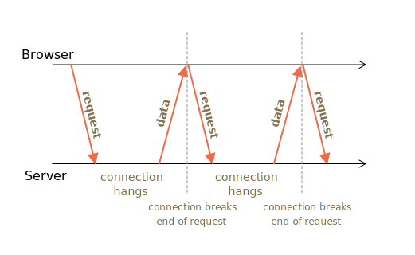

# L'interrogation longue 

<<<<<<< HEAD
L'interrogation longue est le moyen le plus simple d'avoir une connexion persistante avec le serveur, qui n'utilise aucun protocole spécifique comme WebSocket ou Server Side Events.
=======
Long polling is the simplest way of having persistent connection with server, that doesn't use any specific protocol like WebSocket or Server Sent Events.
>>>>>>> ea7738bb7c3616bb51ff14ae3db2a2747d7888ff

Étant très facile à mettre en œuvre, elle est également assez bonne dans de nombreux cas.

## Interrogation régulière

Le moyen le plus simple d'obtenir de nouvelles informations du serveur est l'interrogation périodique. Autrement dit, des requêtes régulières au serveur : "Bonjour, je suis là, avez-vous des informations pour moi ?". Par exemple, une fois toutes les 10 secondes.

En réponse, le serveur se signale d'abord à lui-même que le client est en ligne, et deuxièmement - envoie un paquet de messages qu'il a reçu jusqu'à ce moment.

Cela fonctionne, mais il y a des inconvénients :
1. Les messages sont transmis avec un délai allant jusqu'à 10 secondes (entre les requêtes).
2. Même s'il n'y a pas de messages, le serveur est bombardé de requêtes toutes les 10 secondes, même si l'utilisateur est passé ailleurs ou est endormi. C'est une charge à gérer, en termes de performances.

Donc, si nous parlons d'un très petit service, l'approche peut être viable, mais en général, elle doit être améliorée.

## Interrogation longue

"L'interrogation longue" est une bien meilleure façon d'interroger le serveur.

Elle est également très facile à mettre en œuvre et délivre des messages sans délai.

Le flux :

1. Une requête est envoyée au serveur.
2. Le serveur ne ferme pas la connexion tant qu'il n'a pas de message à envoyer.
3. Lorsqu'un message apparaît - le serveur répond à la requête avec lui.
4. Le navigateur fait immédiatement une nouvelle requête.

Lorsque le navigateur a envoyé une demande et a une connexion en attente avec le serveur est une situation relativement courante pour cette méthode. Ce n'est que lorsqu'un message est remis que la connexion est rétablie.



Si la connexion est perdue, en raison, par exemple, d'une erreur de réseau, le navigateur envoie immédiatement une nouvelle demande.

Une esquisse de la fonction `subscribe` côté client qui fait de longues requêtes :

```js
async function subscribe() {
  let response = await fetch("/subscribe");

  if (response.status == 502) {
    // Le statut 502 est une erreur de dépassement de délai de connexion,
    // peut se produire lorsque la connexion est en attente depuis trop longtemps,
    // et le serveur distant ou un proxy l'a fermé
    // reconnectons-nous
    await subscribe();
  } else if (response.status != 200) {
    // Une erreur - affichons-la
    showMessage(response.statusText);
    // Reconnexion en une seconde
    await new Promise(resolve => setTimeout(resolve, 1000));
    await subscribe();
  } else {
    // Obtenons et affichons le message
    let message = await response.text();
    showMessage(message);
    // Appelons à nouveau subscribe() pour recevoir le message suivant
    await subscribe();
  }
}

subscribe();
```

Comme vous pouvez le voir, la fonction `subscribe` effectue une extraction, puis attend la réponse, la gère et se rappelle.

```warn header="Le serveur devrait être ok avec de nombreuses connexions en attente"
L'architecture du serveur doit pouvoir fonctionner avec de nombreuses connexions en attente.

Certaines architectures de serveur exécutent un processus par connexion ; résultant en autant de processus que de connexions, alors que chaque processus consomme pas mal de mémoire. Donc, trop de connexions consommeront tout.

C'est souvent le cas pour les backends écrits dans des langages comme PHP et Ruby.

Les serveurs écrits avec Node.js n'ont généralement pas ce genres de problèmes.

Cela dit, ce n'est pas un problème de langage de programmation. La plupart des langages modernes, y compris PHP et Ruby, permettent d'implémenter un backend approprié. Assurez-vous simplement que l'architecture de votre serveur fonctionne correctement avec de nombreuses connexions simultanées.
```

## Démo: un tchat

Voici un tchat de démonstration, vous pouvez également le télécharger et l'exécuter localement (si vous connaissez Node.js et pouvez installer des modules) :

[codetabs src="longpoll" height=500]

Le code du navigateur est dans `browser.js`.

## Zone d'utilisation

L'interrogation longue fonctionne très bien dans les situations où les messages sont rares.

Si les messages arrivent très souvent, alors le tableau des messages de demande de réception, schématisé ci-dessus, ressemble à une scie.

Chaque message est une requête distincte, fournie avec des en-têtes, une surcharge d'authentification, etc.

Donc, dans ce cas, une autre méthode est préférée, comme [Websocket](info:websocket) ou [Événements envoyés par le serveur](info:server-sent-events).
